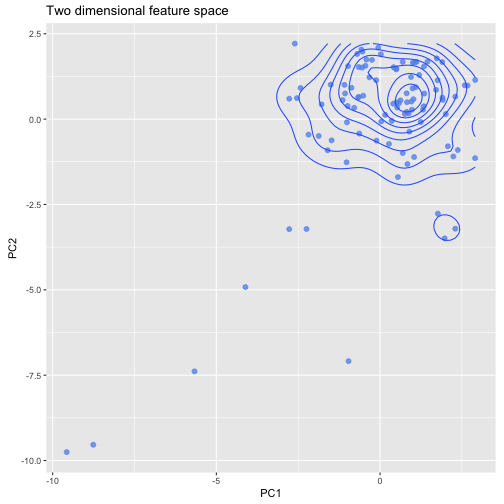

<!-- README.md is generated from README.Rmd. Please edit that file -->

<!-- rmarkdown v1 -->


# oddstream 

[](https://www.repostatus.org/#wip)
[](https://www.gnu.org/licenses/gpl-3.0.en.html)

[](https://travis-ci.org/pridiltal/oddstream)
 
---
 
[](https://cran.r-project.org/)
[](https://cran.r-project.org/package=oddstream)
[](commits/master)
 
---
 
[](/commits/master)


 
---

The goal of oddstream (Outlier Detection in Data Streams) is to propose a framework that provides real time support for early detection of anomalous series within a large collection of streaming time series data. By definition, anomalies are rare in comparison to a system's typical behaviour. We define an anomaly as an observation that  is very unlikely given the forecast distribution. The algorithm first forecasts a boundary for the system's typical behaviour using a representative sample of the typical behaviour of the system. An  approach based on extreme value theory is used for this boundary prediction process. Then a sliding window is used to test for anomalous series within the newly arrived collection of series. Feature based representation of time series is used as the input to the model. To cope with concept drift, the forecast boundary for the system's typical behaviour is updated periodically.

This package is still under development and this repository contains a development version of the R package *oddstream*.

## Installation

You can install oddstream from github with:


```r
# install.packages("devtools")
devtools::install_github("pridiltal/oddstream")
```

## Example

### Multivariate time series plot of `anomalous_stream` dataset  available in `oddstream` package 


```r
library(oddstream)
library(tidyverse)
t <- nrow(anomalous_stream)
f <- ncol(anomalous_stream)
data <- as_tibble(anomalous_stream) %>%
  gather() %>%
  mutate(key = rep((1:f), each = t), Time = rep(1:t, f)) %>%
  setNames(c("Cable", "Value", "Time"))


p <- data %>% 
  ggplot(aes(x = Time, y = Cable, fill = Value)) +
  geom_tile() +
  scale_fill_gradientn(colours = c("#F0E442", "#000000", "#000000"), values = c(0, .1, max(anomalous_stream))) +
  scale_x_continuous(breaks = seq(0, 1400, 200)) +
  scale_y_continuous(breaks = seq(0, 600, 100)) +
  labs(x= "Time", y= "Time Series ID")

p
```


### Two dimensional feature space 


```r
library(oddstream)
features <- extract_tsfeatures(anomalous_stream[1:100, 1:100])
pc <- get_pc_space(features)
p <- gg_featurespace(pc)
p
```


```r

# Perform a 2D kernel density estimation using MASS::kde2d() and display the results with contours.
p + ggplot2::geom_density_2d()
```




```r
library(oddstream)
# Considers the first window  of the data set as the training set and the remaining as the test stream
train_data <- anomalous_stream[1:100, ]
test_stream <- anomalous_stream[101:1456, ]

output <- find_odd_streams(train_data, test_stream, plot_type = "none", trials = 100)
```

### Further Details

```r
?oddstream
```

## References

- Clifton, D. A., Hugueny, S., & Tarassenko, L. (2011). Novelty detection with multivariate extreme value statistics. Journal of signal processing systems, 65 (3), (pp. 371-389).

- Hyndman, R. J., Wang, E., & Laptev, N. (2015). Large-scale unusual time series detection. In 2015 IEEE International Conference on Data Mining Workshop (ICDMW), (pp. 1616-1619). IEEE.

- Talagala, P. D., Hyndman, R. J., Smith-Miles, K., Kandanaarachchi, S., & Muñoz, M. A. (2018). Anomaly Detection in Streaming Nonstationary Temporal Data. Working paper 4/18, Department of Econometrics & Business Statistics, Monash University.


